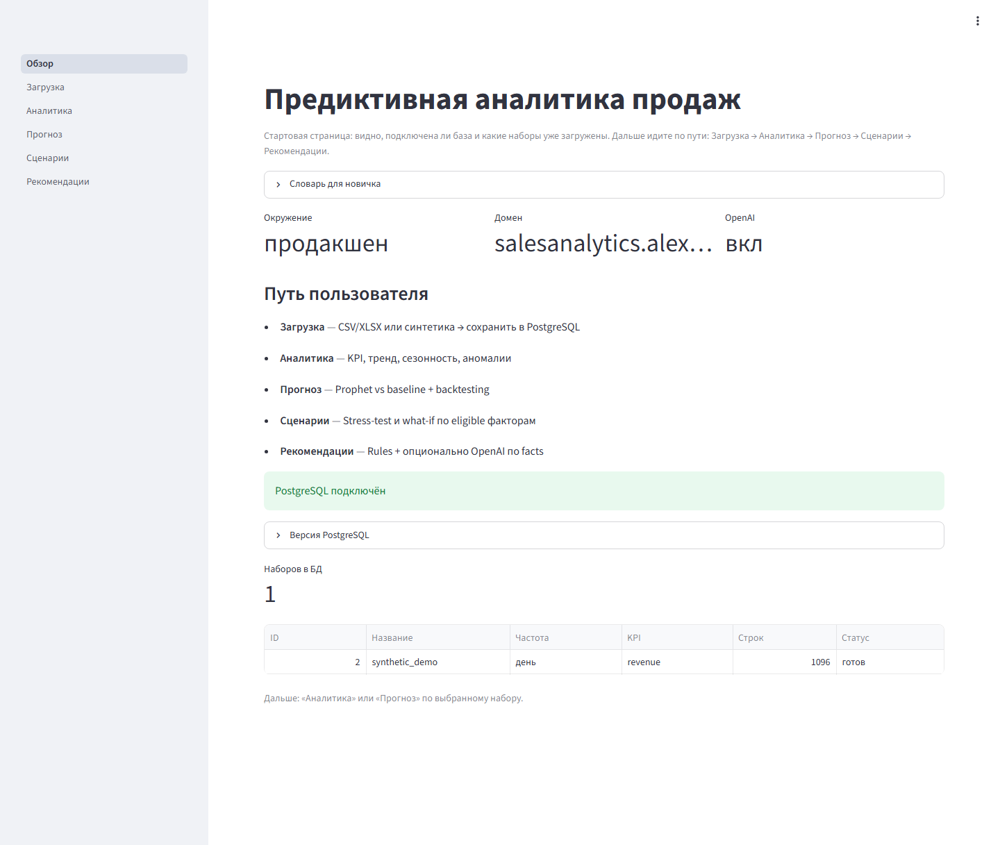

# AI-система предиктивной аналитики продаж

Веб-MVP: загрузка истории продаж → аналитика → проверяемый прогноз → сценарии «что если» → рекомендации.  
UI на русском. OpenAI опционален: без ключа продукт полностью работает на правилах.

**Демо:** https://salesanalytics.alexklyvibe.ru  

---

## Материалы

| Что | Ссылка |
|---|---|
| Техническое задание (DOCX) | [docs/TZ_AI_prediktivnaya_analitika_prodazh.docx](docs/TZ_AI_prediktivnaya_analitika_prodazh.docx) |
| Видео основного сценария (MP4) | [docs/demo/demo_osnovnoj_scenarij.mp4](docs/demo/demo_osnovnoj_scenarij.mp4) |
| Скриншоты (части + full-page) | [docs/screenshots/](docs/screenshots/) |

### Скриншоты по страницам

| Страница | Full-page | Куски со скроллом |
|---|---|---|
| Обзор | [01_obzor_full.png](docs/screenshots/01_obzor_full.png) | [01…](docs/screenshots/01_obzor_01.png) |
| Загрузка | [02_zagruzka_full.png](docs/screenshots/02_zagruzka_full.png) | [02…](docs/screenshots/02_zagruzka_01.png) |
| Аналитика | [03_analitika_full.png](docs/screenshots/03_analitika_full.png) | [03…](docs/screenshots/03_analitika_01.png) |
| Прогноз | [04_prognoz_full.png](docs/screenshots/04_prognoz_full.png) | [04…](docs/screenshots/04_prognoz_01.png) |
| Сценарии | [05_scenarii_full.png](docs/screenshots/05_scenarii_full.png) | [05…](docs/screenshots/05_scenarii_01.png) |
| Рекомендации | [06_rekomendacii_full.png](docs/screenshots/06_rekomendacii_full.png) | [06…](docs/screenshots/06_rekomendacii_01.png) |

<p align="center">
  
</p>

---

## Что реализовано в MVP

Пользовательский путь: **Загрузка → Аналитика → Прогноз → Сценарии → Рекомендации**.

- **Загрузка** CSV/XLSX или синтетический пример; сопоставление колонок; KPI и частота (день/неделя/месяц); отчёт качества; сохранение в PostgreSQL.
- **Аналитика** без OpenAI: KPI, тренд, сезонность, аномалии, связь факторов с продажами (с понятными подписями).
- **Прогноз:** Prophet vs сезонный baseline, rolling backtesting, метрики MAE/RMSE/WAPE/sMAPE, статусы качества, доверительный интервал.
- **Сценарии:** простой сдвиг прогноза ±%; what-if по eligible факторам (скидка, акция, реклама, дефицит…); оценка прибыли/ROI только при наличии маржи или себестоимости+цены.
- **Рекомендации:** rule-based всегда; OpenAI опционально по агрегированным facts (валидация чисел, кэш, fallback).
- **Экспорт** CSV (прогноз/сценарии) и TXT (рекомендации).
- **Инфра:** Docker Compose (app + PostgreSQL + Caddy), HTTPS, Basic Auth, Alembic-миграции, backup/restore скрипты.
- **Качество:** unit/integration-тесты, ruff/mypy, лимиты upload, санитизация prompt/PII, ошибки UI без traceback.

Ограничения MVP: не multi-tenant SaaS; точность не обещается на коротких/редких рядах; stress-% и корреляции ≠ причинность.

---

## Стек

Python 3.12 · Streamlit · PostgreSQL · SQLAlchemy/Alembic · Prophet · pandas/scikit-learn · OpenAI (опц.) · Docker / Caddy

---

## Структура репозитория

```
app.py                 # вход Streamlit + навигация
pages/                 # страницы UI (RU)
src/
  analytics/           # KPI, тренд, сезонность, аномалии, корреляции
  data/                # loader, mapping, validator, pipeline
  db/                  # models, repositories, session
  forecasting/         # Prophet, baseline, backtesting, metrics
  scenarios/           # stress, eligibility, effects, profit
  recommendations/     # facts, rules, OpenAI, cache, validate
  export/              # CSV/TXT отчёты
  security/            # sanitize / secret heuristics
  ui/                  # labels, help_texts, charts, feedback
migrations/            # Alembic
sample_data/           # synthetic_sales.csv
scripts/               # deploy, backup, capture_demo, generate_tz_docx
tests/                 # unit + integration
docs/                  # ТЗ, screenshots, demo video
compose.yaml           # prod-стек
env.example            # шаблон переменных
```

---

## Входной формат данных

Минимум: **дата** + **числовой показатель** (выручка / штуки / заказы…).  

Опционально: скидка %, флаг акции, рекламный бюджет, цена, дефицит, измерения (категория, канал, регион…).  
Для блока прибыли: маржа % **или** себестоимость + цена продажи.

Пример: [`sample_data/synthetic_sales.csv`](sample_data/synthetic_sales.csv).

---

## Быстрый старт (локально)

```bash
python -m venv .venv
# Windows: .venv\Scripts\activate
pip install -r requirements.txt
cp env.example .env   # задайте POSTGRES_* / DATABASE_URL
alembic upgrade head
streamlit run app.py
```

Прод на VPS: `docker compose up -d --build` (см. `compose.yaml`, `Caddyfile`, `env.example`).  
Перегенерация скринов/видео демо: `python scripts/capture_demo.py`.

---

## Что можно добавить дальше

- Multi-user / роли / изоляция датасетов (настоящий multi-tenant).
- Автоподбор моделей шире Prophet (например LightGBM/TFT) и автокалендарные регрессоры.
- Причинные / uplift-оценки вместо «корреляция + what-if».
- Алерты (email/Telegram) по аномалиям и падению качества прогноза.
- Планировщик переобучения и мониторинг drift.
- Более богатый P&L (маржа по SKU, ROI кампаний) и связка с CRM/рекламными API.
- SSO, аудит действий, rate-limit на upload/OpenAI.
- Публичный «guest mode» только на синтетике без Basic Auth.

---

## Лицензия

Пока не зафиксирована отдельным файлом — уточняется при публикации материалов сдачи.
